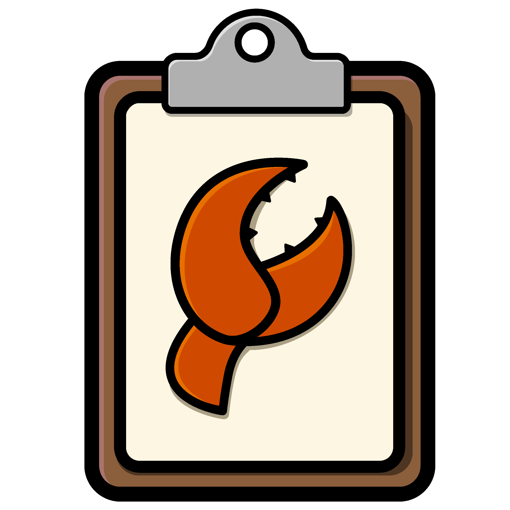

<p align=center>
 
</p>

<h1 align=center>Claw</h1>
<p align=center>
 <em>Crustacean powered clipboard for X11 & Wayland</em>
</p>

## Features
- **Cross-platform** design (X11 `xclip`/Wayland `wl_clipboard`)
- **Window Manager** friendly (Keyboard driven interface)
- **Clipboard History** with configurable limit
- **System Tray Integration** with quick access to recent items
- **Highly** customizable (keybinds, titlebar, force-dark)	
- **Themeable** with several built-in themes, including:
	- 🐱 Catpuccin
	- 🧛🏻 Dracula
	- ☮️ Gruvbox
	- ❄️ Nord
	- ☀️ Solarized

## Installation

If you are running Arch Linux you can grab the `claw` 
package from the `aur`

```bash
yay -S claw
```
or

```bash
paru -S claw
```

### Manual Install:
Grab the latest download from the [releases](https://github.com/saltnpepper97/claw/releases)
page. If you are on **Debian** you can use the provided `.deb` file.

## Keybinds

### Navigation
| Key | Action | Description |
|-----|--------|-------------|
| <kbd>k</kbd> | Move Up | Navigate to previous clipboard entry |
| <kbd>j</kbd> | Move Down | Navigate to next clipboard entry |

### Actions
| Key | Action | Description |
|-----|--------|-------------|
| <kbd>Return</kbd> | Select | Copy selected entry to clipboard |
| <kbd>x</kbd> | Delete | Remove current entry from history |
| <kbd>Shift</kbd>+<kbd>x</kbd> | Delete All | Clear entire clipboard history |

### Customization
All keybinds are fully customizable through the configuration file. See the example configuration below.

## Example Configuration

```rune
@author "Dustin Pilgrim"
@description "Feature packed clipboard manager for X11/Wayland"

clipboard:
    theme = "default"
    history-max-length = 100
    enable_titlebar = true
    force-dark-mode = false

    keybinds:
      up "k"
      down "j"
      delete "x"
      delete-all "Shift+x"
      select "Return"
    end
end
```

## System Tray

Claw includes a system tray icon for quick access:
- **Left Click:** Show/hide the main window
- **Recent Clipboard:** Access your 5 most recent clipboard entries
- **Clear History:** Quickly clear all clipboard history
- **Quit:** Exit the application

## Contributing

Contributions are welcome! Feel free to open issues or submit pull requests.

### Adding Themes

Want to contribute a new theme? We'd love to see your creativity!

1. Check out the `examples/themes/` directory to see the theme structure
2. Create your theme file following the established format
3. Test your theme with Claw to ensure all colors work well
4. Submit a pull request with your theme

Theme submissions should include appropriate color choices for:
- Background colors
- Foreground/text colors
- Accent colors
- Selection colors
- Border colors

Make sure your theme provides good contrast and readability!
